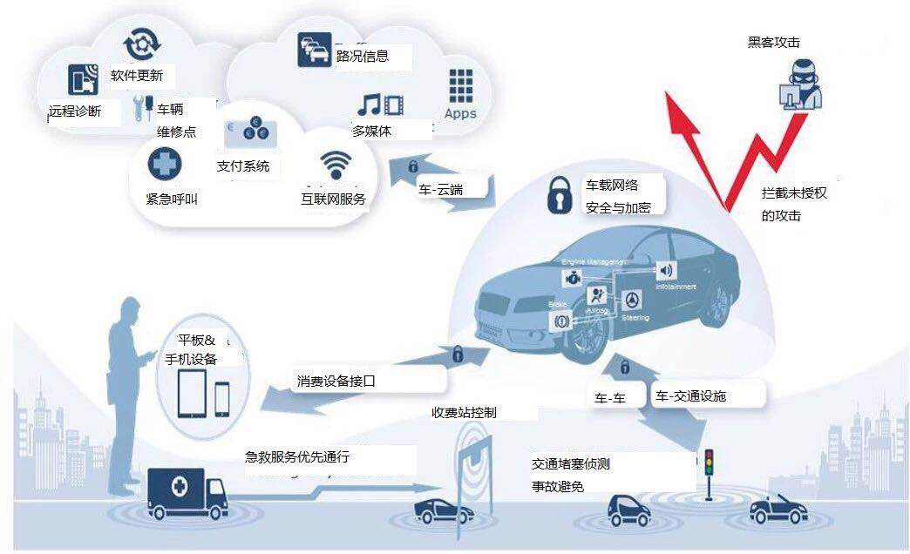

# 汽车安全攻击和破解

TODO：

* CIVC王羽：《汽车自动驾驶技术路线图》 信息安全技术 - 安全内参 | 决策者的网络安全知识库
  * https://www.secrss.com/articles/9404

------

传统汽车，往往是不联网的。

现在的汽车，往往联了网，常被叫做：`智能网联汽车`=`ICV`=`Intelligent Connected Vehicle`

汽车，一旦联网，就增加了各种安全风险。

## 破解

### 破解案例

* [汽车黑客揭秘：我是如何通过逆向API接口黑掉宝马i3的](https://shkspr.mobi/blog/2015/11/reverse-engineering-the-bmw-i3-api/)
  * Github
    * https://github.com/edent/BMW-i-Remote/
  * 中文翻译
    * [[翻译]对宝马车载apps协议的逆向分析研究-『智能设备』-看雪安全论坛](https://bbs.pediy.com/thread-257530.htm)

## 防护

希望可以防止未授权的攻击：

