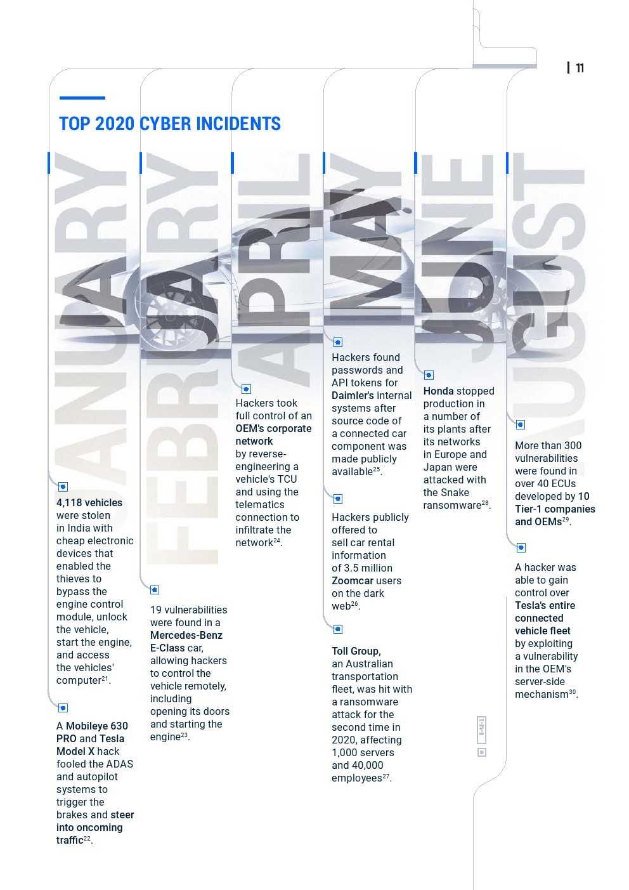

# 安全事件

* 汽车安全事件
  * 正向=汽车安全
    * Enev利用机器学习算法，对汽车控制器局域网络（CAN， controller area network）总线数据进行特征提取，实现对汽车驾驶员的身份识别，证明了用户隐私存在被泄露的风险
    * 腾讯科恩安全实验室研究员远程入侵了特斯拉汽车的网关、车身控制模块（BCM）和自动驾驶控制单元，证明了汽车中存在很多安全隐患
    * Zeng等使用便携式GPS欺骗器实现了非法篡改车辆的GPS路线，严重威胁了车载GPS安全
    * Miller等在DEFCON会议中指出，ICV中存在大量可被利用的攻击面，如远程无钥匙进入（RKE，remote keyless entry）、蓝牙、Wi-Fi、车载资讯系统、互联网、APP等，都有可能使用户隐私泄露，甚至导致车辆被远程控制
  * 逆向=汽车破解=汽车攻击
    * 特斯拉
      * 2015年，黑客就曾入侵了特斯拉Model S的车载系统，导致其在行驶过程中突然熄火
      * 2017年，来自360公司和腾讯公司的安全技术人员分别展示了如何“无钥匙”远程进入特斯拉的车载系统和电网系统
      * 通过使用一种名为Worley的噪音（Worley噪声能够模拟石头，水或其他噪音的纹理）生成函数，通过加补丁的方式生成所需的对抗样本图片，可以启动特斯拉的自动雨刮器
      * 2020年，全球更是发生了多起特斯拉App宕机事件，致使手机无法与车辆进行链接，车主处于“盲开”状态，甚至有些车主被锁在车中
    * Jeep
      * 自由光
        * 2015年7月，两位著名白帽黑客查理·米勒以及克里斯·瓦拉塞克曾入侵了一辆Jeep自由光的Uconnect车载系统，通过软件远程向该系统发送指令，启动了车上的各种功能
    * 日产
      * 2016年，日产汽车不得不关闭其专为Leaf系列开发的应用程序Nissan Connected EV，因为他们发现，黑客可以侵入汽车系统，控制电池操作等功能，以耗尽电池
    * 其他
      * 奥迪、保时捷、宾利和兰博基尼等大众旗下品牌的Megamos Crypto防护系统也都被黑客攻破过
      * 黑客获取智能汽车的T-Box通讯模块后，即可通过通讯模块接入车厂私有网络，进而攻击车厂内网导致TSP沦陷
      * 在道路上贴上对抗样本贴纸，则能误导自动驾驶系统，使车辆行驶到对面的车道造成逆行
      * 数字车钥匙漏洞也让汽车安全存在更多隐患
* 2020年汽车安全事件
  * 

