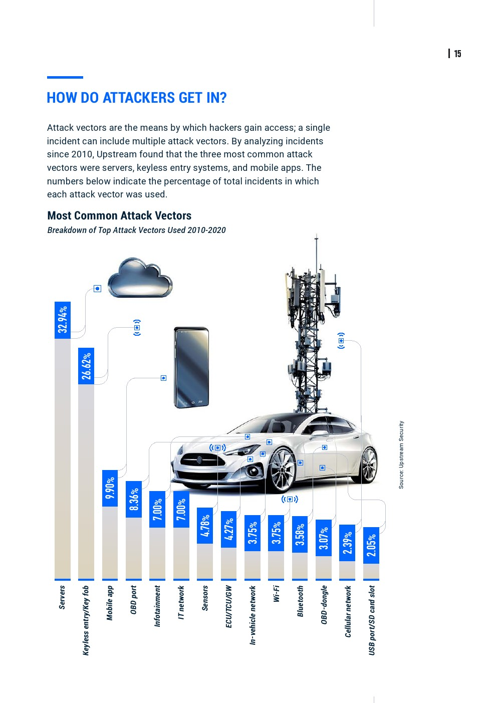

# 攻击风险和角度

此处整理汽车安全攻击相关内容。

## 汽车安全类型

* 汽车安全类型
  * 根据风险类型分
    * 智能汽车的网络安全威胁：7类
      * 手机App漏洞
      * 云端服务器漏洞
      * 不安全的外部连接
      * 远程通信接口漏洞
      * 不法分子反向攻击服务器以获取数据
      * 车载网络指令被篡改
      * 车载部件系统因固件刷写、提取、植入病毒等被破坏

## 攻击风险

* 2020车联网信息安全十大风险
  * 数据来源：中汽数据
  * 概述
    * 文字
      * 相较于2019车联网安全风险TOP来说，不安全的生态接口问题仍然占据第一位置，总占比约25%，系统固件可被提取及逆向问题由2019年年的第六名，提升到了今年的第五名，总占比约10%，已知漏洞的组件问题  在排名由第七名上升到第六名，总占比约9%，车载网络未做安全隔离问题由第五名下降到第七名，总占比约7%
    * 图
      * 
* Upstream Security
  * 2020年《汽车网络安全报告》
    * 自2016年至2020年1月，汽车网络安全事件的数量增长了605%，仅2019一年就增长了一倍以上
      * 82％涉及短程和远程攻击
      * 在过去十年中，前三大攻击媒介
        * 无钥匙进入系统（30％）
        * 后端服务器（27％）
        * 移动应用程序（13％）
      * 安全事件造成的后果
        * 汽车盗窃/入侵（31％）
        * 对汽车系统的控制（27％）
        * 数据/隐私泄露（23％）

## 攻击角度

对于汽车，有各种角度可以利用和攻击。

其中：

* 常规性安全风险
  * APP
  * 云平台
* 其他
  * 零部件
    * T-BOX
      * 固件逆向，攻击者通过逆向分析 T-BOX 固件，获取加密算法和密钥，解密通信协议，重放篡改指令
      * 利用调试口访问无身份校验漏洞，通过焊接的方式连接调试线，车载T-BOX可深度读取汽车Can总线数据和私有协议，从硬件层获取shell，导致信息泄露问题
      * 固件后门：TBox的固件刷写功能是由IVI提供，在TBox刷入固件首先要在整体升级包中分离出TBox的固件包，并将后门文件写入到固件包中
      * 网络劫持：TBox通常会支持2G/3G/4G，所以基于GSM或LTE的伪基站都可以劫持TBox的网络连接，劫持T-BOX会话，通过伪造协议实施对车身控制域、汽车动力总成域等的远程控制
    * IVI
      * 硬件调试接口：观察主板的MCU型号及引脚信息，可以通过焊接连接调试线，从硬件层获取shell
      * 通过内置浏览器访问恶意页面，安装任意应用程序
      * 拒绝服务攻击:利用恶意程序大量耗费系统内存，使其无法正常提供服务
      * 刷入后门：如果获取了刷写系统固件的权限，可以直接将后门程序通过刷写固件的方式写入系统中，如开机启动脚本、dropbear、msf后门等
  * OTA风险
    * 升级包中间人攻击：OTA升级功能，测试过程中可以通过拦截或者抓取流量包，修改后重新发送
    * 欺骗攻击，同第一个类似，类似于伪造升级包发送给车端
  * 无线电测试风险
    * 这个类似于常规的无线电测试，指对汽车智能无线钥匙、蓝牙、WIFI、GPS和胎压监测单元等车载无线电组件进行的渗透包括但不限于干扰测试
      * 一般包括信号屏蔽、信号篡改、中间人攻击、蓝牙劫持、蓝牙嗅探、信号截取、重放攻击等技术手段
  * CAN风险
    * CAN报文重放
      * 利用录制的CAN报文进行重放，在未接触并操作车辆实际物理操作界面的情况下，实现对车辆的相关控制与操作
    * CAN 模糊测试
      * 利用CAN报文模糊测试并暴力破解数据位控制指令，通过得到的数据位控制指令进行车辆控制及操作
      * 攻击类型
        * 报文过滤绕过：CAN总线会针对TBox发送的报文进行过滤操作，通常是基于CAN ID及CAN Data的头部字节，测试时可以针对相关字段进行模糊测试
        * 绕过状态检查：CAN总线中的ECU在执行指令之前会进行状态检查，如车辆是否在行驶中档位设置等，绕过检查并执行恶意报文会产生更大的破坏，漏洞也更严重
        * 拒绝服务：测试工具通过随机生成大量数据，将数据发送给车辆，可以通过发送大量伪造报文来进行拒绝服务攻击

## 攻击手法

* 攻击手法
  * 传统的攻击手法
  * 新的
    * 利用超声波的`海豚音`攻击
    * 利用照片以及马路标识线的AI攻击
* 攻击进入车辆方式
  * 
