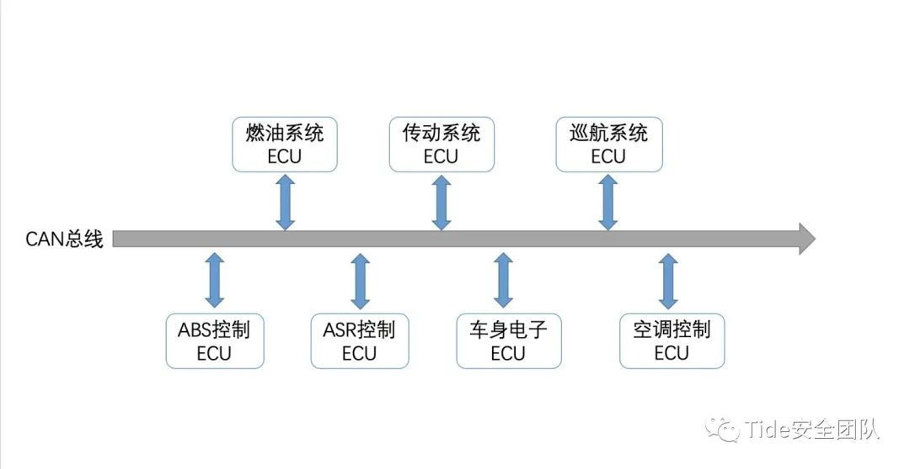

# CAN

* `CAN`=`Controller Area Network`=`控制器局域网`
  * ==`CAN总线`=`Controller Area Network Bus`
  * 是什么：一种能够实现分布式实时控制的串行通信网络
  * 优点：传输速度最高到1Mbps，通信距离最远到10km，无损位仲裁机制，多主结构
  * 概述：由以研发和生产汽车电子产品著称的德国BOSCH公司开发的，并最终成为国际标准`ISO 11898`，是国际上应用广泛的现场总线之一
  * 用途：是制造厂中连接现场设备（传感器、执行器、控制器等）、面向广播的串行总线系统，最初开发用于汽车工业，后来也应用于工业自动化
  * 现状：CAN有很多优秀的特点，使得它能够被广泛的应用
  * 举例
    * 汽车内的CAN总线
      * 
