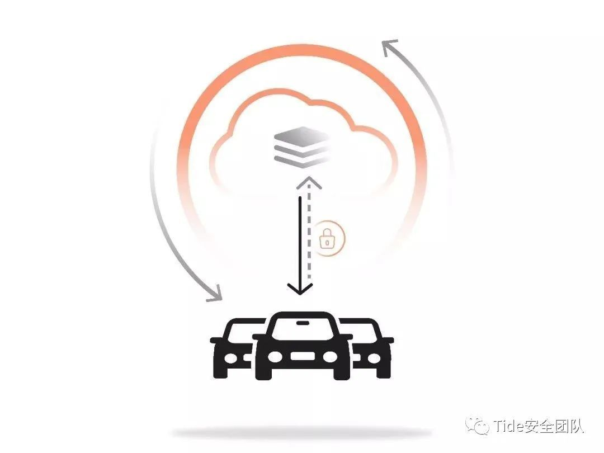

# OTA

* `OTA`=`Over The Air`=`无线更新`
  * 是什么：一项基于短消息机制的远程更新技术
    * 即终端通过无线或蜂窝网络的接口与服务器连接来实现对本地设备数据的更新
      * 具体是指通过服务器、移动通信网络和终端等的网络连接
        * 最终实现终端内存储数据的更新，进而改善终端的功能和服务作用
  * 对比：传统更新设备的固件，都是要通过有线网络和接口去更新的。而OTA无线更新，和有线比，更加方便。
  * 用途
    * 给汽车中的软件(模块、系统、固件)通过OTA更新
      * 

## 汽车OTA升级

* 两种方式
  * `FOTA`=`Firmware OTA`=`固件在线升级`
    * 指的是给一个设备、ECU 闪存下载完整的固件镜像，或者修补现有固件、更新闪存，用户也可以通过特定的刷新程序进行 FOTA 升级，影响的是动力系统、电池管理系统等
  * `SOTA`=`Software OTA`=`软件在线升级`
    * 那些看上去离使用者更近的应用程序和地图OTA，都属于`SOTA`的范畴，如应用程序（App）、车载地图、人机交互界面等功能
