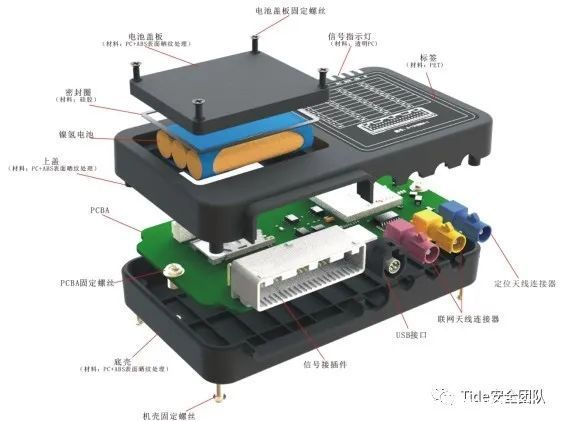

# T-Box

* `T-BOX` = `Telematics BOX` = `远程信息处理器`
  * 组件：包含OBD、MCU/CPU、FLASH、SENSOR、GPS、3G/4G、WiFi/蓝牙等模块
  * 作用：用于车与车联网服务平台之间通信
    * 对内：与车载 CAN 总线相连，实现指令和信息的传递
    * 对外：通过云平台与手机/PC 端实现互联，车内外信息交互的纽带其主要功能是为汽车提供网络连接
  * 用途
    * T-B0X可实现车辆远程控制、远程查询、安防服务等功能
      * 举例
        * 远程控制车门、车窗、空调等开启
        * 远程车辆定位、查询车况信息;车辆异动报警紧急救援求助等
  * 举例
    * 某T-BOX厂家产品
      * 
  * 注意
    * T-B0X 为人们生活提供了越来越多的便利和安全保障，同时也为汽车带来了更多的信息安全隐患
