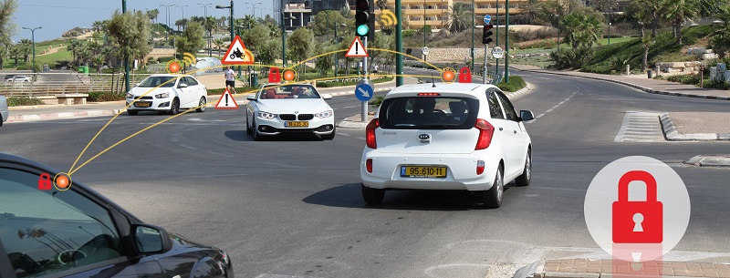
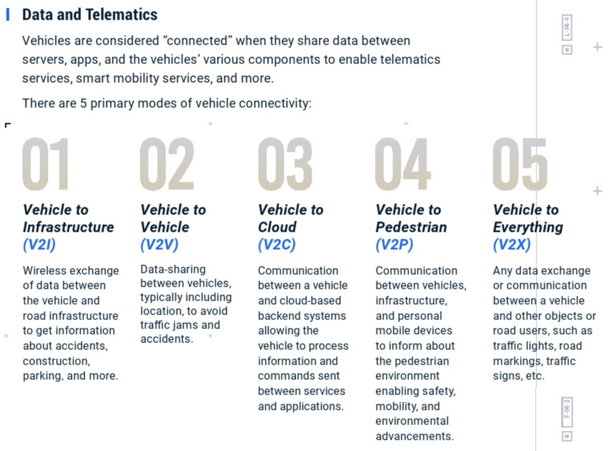

# V2X

* V2X
  * 概述
    * V2X技术使车辆与周围环境（其他车辆、基础设施或行人）之间进行通信，主要应用就是提高道路安全性
    * 要实现V2X技术 （包括采用IEEE802.11p 的互联汽车技术）的愿景，车辆必须能够信任来自周围环境的信息
  * 图
    * 
    * 
  * 产品和方案
    * Autotalks解决方案
      * [汽车网络安全 | 汽车安全系统 | 互联汽车安全 | Autotalks (auto-talks.com)](https://www.auto-talks.com/zh-hans/%E7%9C%9F%E6%AD%A3%E5%AE%89%E5%85%A8/)
  * 相关技术和概念
    * 概览
      * 
    * 包括
      * `V2I`=`Vehicle to Infrastrucure`
      * `V2V`=`Vehicle to Vehicle`
      * `V2C`=`Vehicle to Cloud`
      * `V2P`=`Vehicle to Pedestrian`
      * `V2X`=`Vehicle to Everthing`
