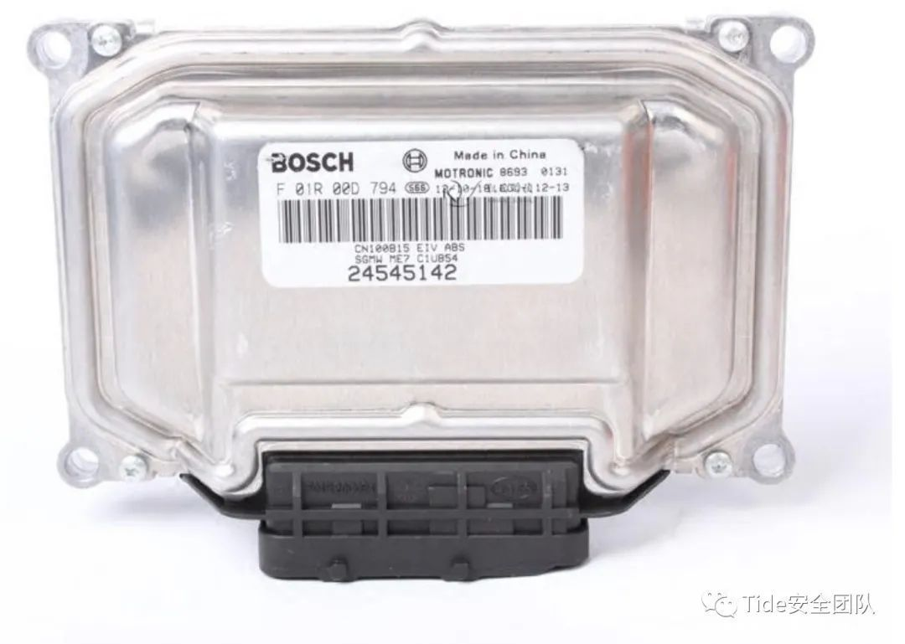
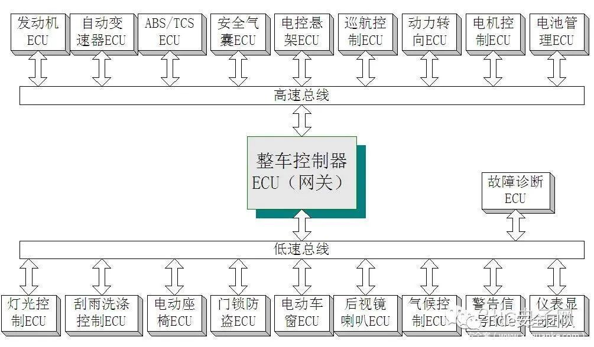

# ECU

* `ECU`=`Electronic Control Unit`=`电子控制器单元`
  * 别称：汽车的`行车电脑`
  * 用途：控制汽车的行驶状态以及实现其各种功能
  * 原理：主要是利用各种传感器、总线的数据采集与交换，来判断车辆状态以及司机的意图并通过执行器来操控汽车
  * 图
    * 
  * 分类
    * 根据功能分
      * 传统燃油车：电控单元主要存在于汽车的三大件上
        * `EMS`=`发动机管理系统`：通过控制进气、喷油、点火实现发动机动力性、经济性、排放等性能的均衡，整车的扭矩解析功能集成在于EMS
        * `TCU`=`变速箱控制单元`：通过电磁阀控制油压，实现离合器自动接合或者分离，在合适的时机完成档位切换，提高车辆的动力性、经济性、平顺性
        * `EPS`=`电动助力转向`：通过电机辅助驾驶员进行转向，降低驾驶难度
        * `ESC`=`车身稳定控制`：集合了TCS、ABS、ESC等功能，通过控制轮端制动力实现车辆的稳定行驶
        * `MRC`=`主动悬挂系统`：控制电磁阀调节悬挂系统高度或阻尼，提高车辆行驶稳定性、舒适性
      * 新能源车：由于动力系统的变化，电控单元有所变化和增加（这里以混动车为例）
        * `VCU`=`整车控制器`：吸收了传统车上的扭矩解析功能，在加上混动车特有的能量管理、高压管理等等功能，形成一个整车控制的枢纽，协调各控制单元配合工作
        * `TCU`=`混动变速箱`：混动变速箱相比于传统变速箱，结构有所变化，往往会集成1个或2个电机，实现串联、并联或功率分流模式，主要通过电机、离合器的配合工作，实现模式的切换
        * `BMS`=`电池管理系统`：主要包括状态监控、高低压控制、充放电控制、SOC估算、电池均衡等功能，实现电池安全高效运行
        * `DCU`=`电机控制器`：通过控制逆变器的输出电流，实现电机扭矩的精确稳定控制
        * `OBC`=`交流充电机`：将220V交流电经过整流变成直流，再经过DCDC变换后给电池充电
        * `Ibooster`=`电动助力制动`：新能源汽车为了尽可能多的实现能量回收，开发了电动助力制动系统，辅助驾驶员进行制动助力，也能在小范围内实现制动解耦，提高能量回收效率
  * 架构图
    * 
