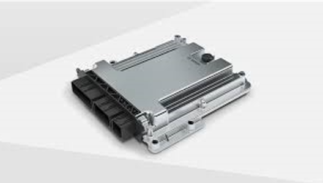

# VCU

* `VCU`=`Vehicle Control Unit`=`整车控制单元`
  * 对于纯电动车：必备单元，相当于整车的大脑
  * 作用
    * 采集电机控制系统信号、踏板信号及其他部件信号，根据驾驶员的驾驶意图综合分析并作出响应判断，同时监控下层的各部件控制器的动作，对汽车的正常行驶、电池能量的制动回馈、网络管理、故障诊断与处理、车辆状态监控等功能起着关键作用
  * 举例
    * 博世VCU模块
      * 
