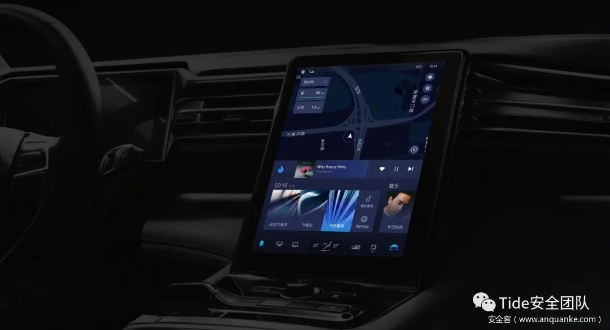

# IVI

* `IVI`=`In-Vehicle Infotainment`=`车载信息娱乐系统`
  * 概述：该部分是车主可以直观接触到的部分，车内中控屏，音响，空调，甚至仪表盘都可以连接到IVI中
  * 发展历史
    * 第一代：IVI提供控制空调，查看里程/燃油，提示手刹/车门于车辆本身直接相关的功能，其实现方式是通过IVI中的CAN芯片向CAN总线或LIN总线发送特定指令实现
    * 第二代：IVI中在功能上更加内聚，其主要负责处理与用户的直接交互（通过触摸屏或车载中控台）和WIFI，FM，GPS等信号的处理
      * 第二代IVI中自身只实现UI，多媒体等功能，而运营商网络上网功能及与下发控车指令（这里的控车指令是指用户在车内控制空调，车座等）的功能则已交到Tbox处理，这使IVI功能更集中
  * 图
    * 
