# AutoSar

* `AutoSar`
  * =`AUTOSAR`=`AUTomotive Open System ARchitecture`=`汽车开放系统架构`
  * 概述：由全球汽车制造商、零部件供应商及其他电子、半导体和软件系统公司建立，目的是为了降低汽车控制软件的开发风险，提高软件复用度
    * AUTOSAR联盟自2003年成立以来，成员队伍不断壮大，基本上涵盖了世界各大著名整车厂、零部件供应商、半导体公司及软件工具开发商。近年来也有越来越多的中国企业例如华为、百度、长城汽车等加入联盟
  * AUTOSAR联盟成员
    * 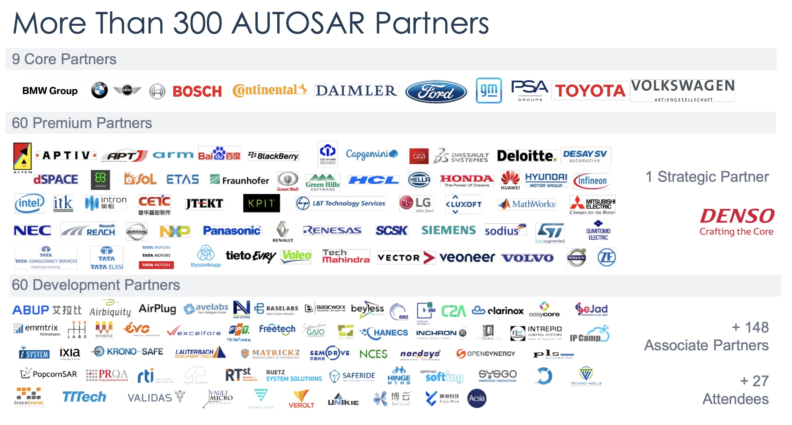
  * AutoSar软件架构
    * 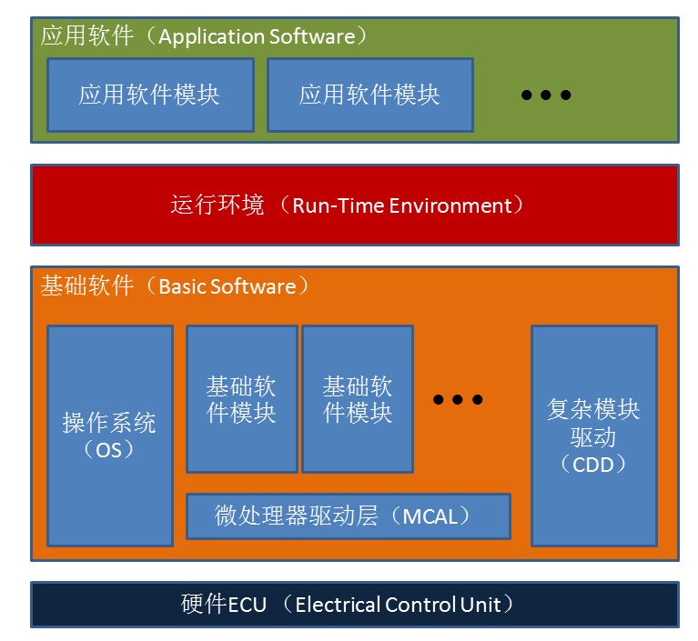
  * AutoSar软件框架
    * 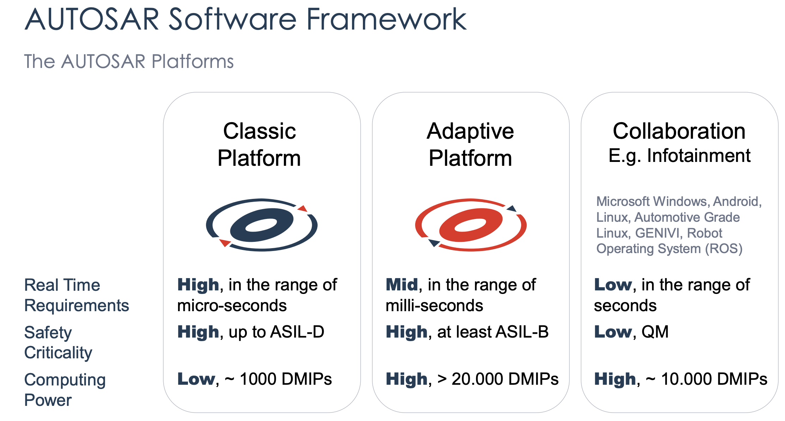
  * 和传统方法对比=AutoSar的基本原则
    * 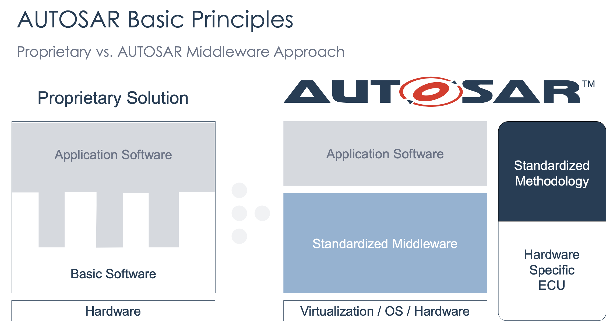
  * 背景
    * 汽车电子电器架构发展趋势
      * 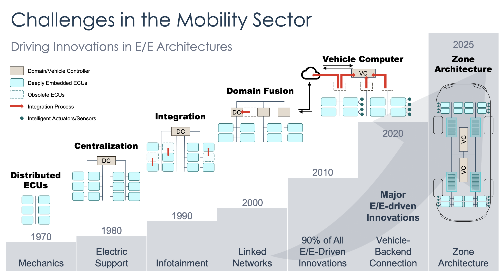
  * AutoSar在车辆网络架构的作用
    * 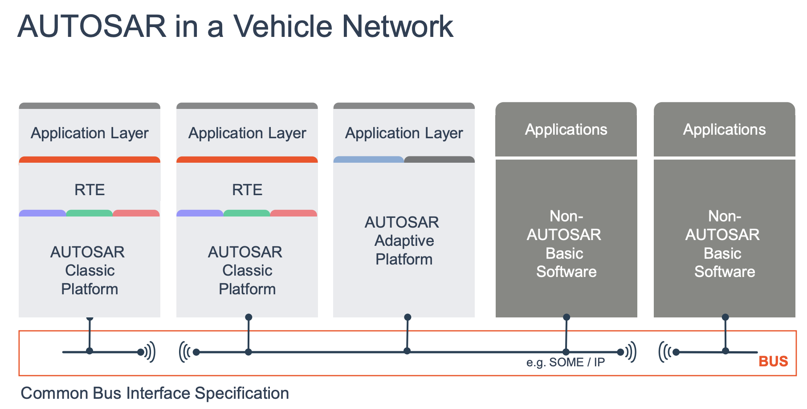
  * AutoSar的平台
    * 经典平台 = Classic Platform
      * 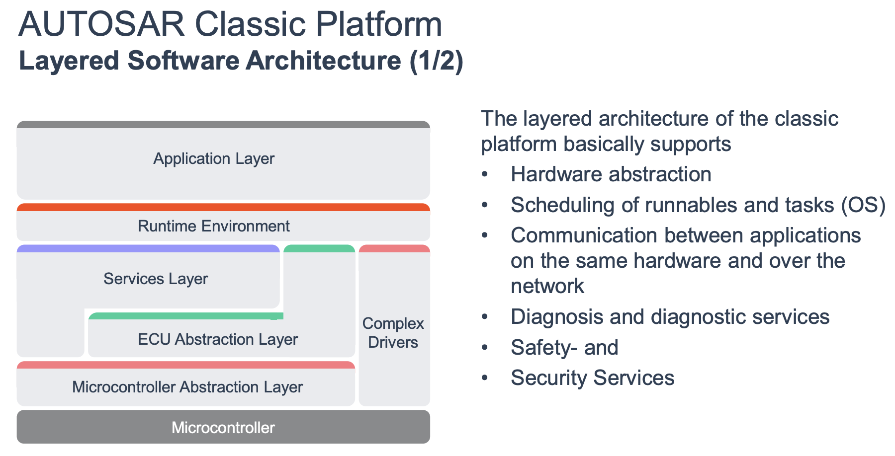
      * 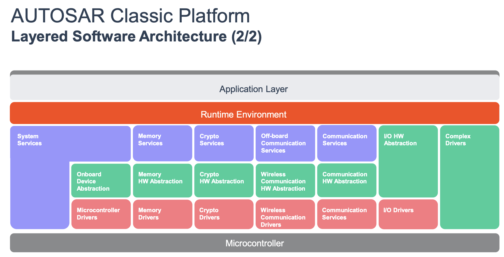
      * 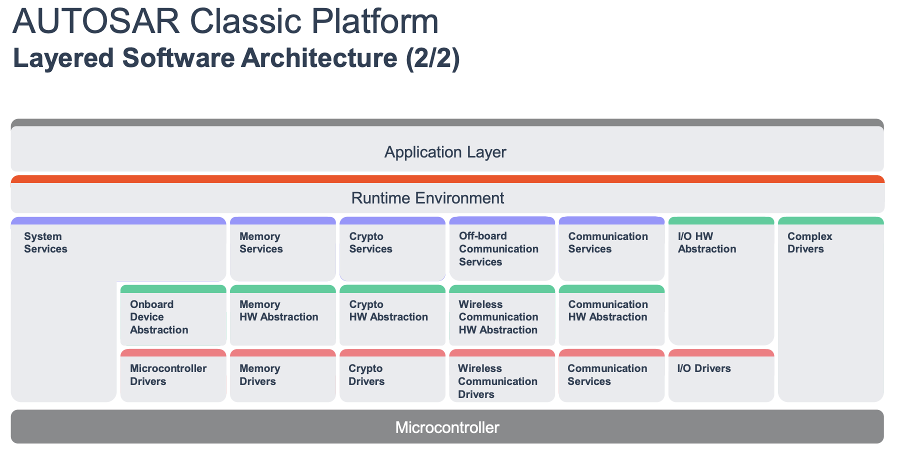
    * 自适应平台 = Adaptive Platform
      * 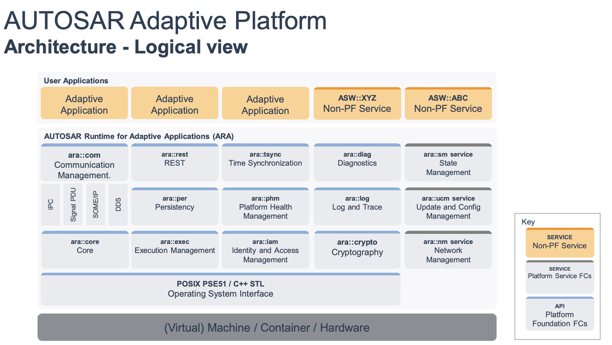
  * 举例
    * Front Light Management
      * 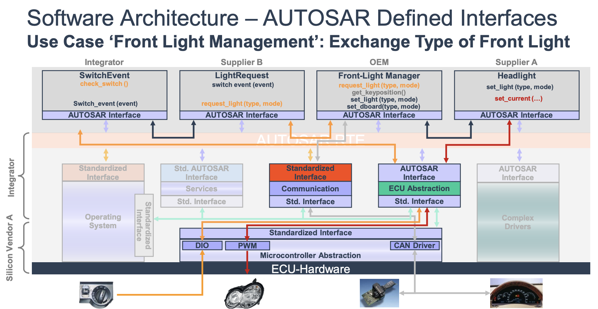
      * 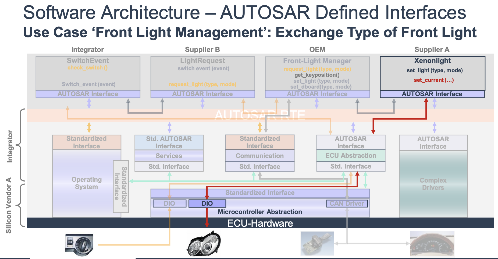
      * 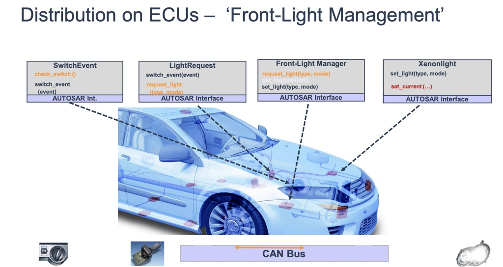
      * 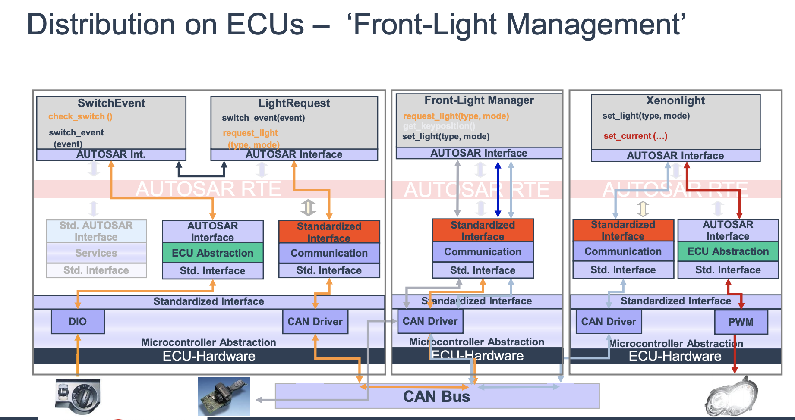
