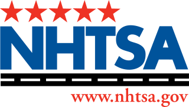

# NHTSA

* `NHTSA`=`National Highway Traffic Safety Administration`=（美国）`国家公路交通安全管理局`
  * 官网
    * NHTSA | National Highway Traffic Safety Administration
      * https://www.nhtsa.gov/
  * Logo
    * 
  * 概述
    * `NHTSA`是美国运输部下的一个执行机构，成立于美国华盛顿特区，其宗旨是“保护生命、防止伤害，减少车辆撞击
      * Save lives, prevent injuries, reduce vehicle-related crashes
  * 主要工作
    * 编写和执行机动车辆相关的安全性、防盗、燃油经济标准相关标准，关于燃油经济业务是依照`CAFE`来制定
      * `CAFE`=`Corporate Average Fuel Economy`=`统合平均燃料效能标准`
    * 给汽车制造商和进口商发放授权
    * 管理允许或栏截进口车辆、汽车安全性零件
    * 掌管车辆识别号码
    * 开发用于安全测试的仿真人偶，和进行安全测试
    * 提供车辆保费相关讯息
    * 统计分析部门（National Center for Statistics and Analysis）制作和更新相关资料
      * 其中的`FARS`=`Fatality Analysis Reporting System`=`事故报告分析系统`的分析数据，被全世界相关研究所关广泛引用
