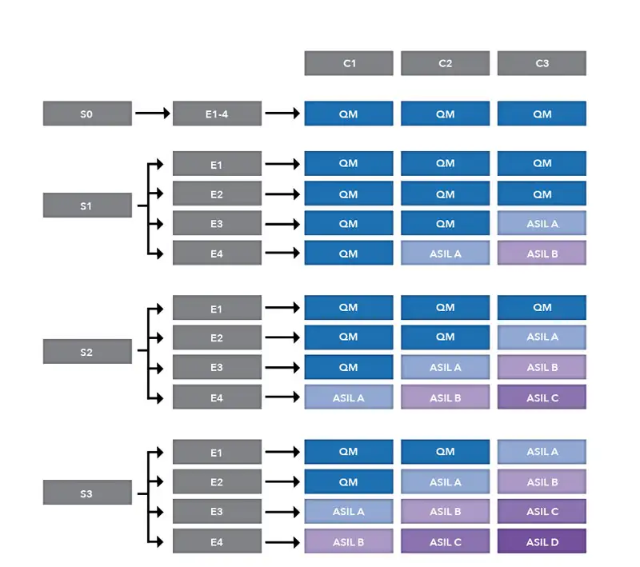

# ISO 26262

* `ISO 26262`
  * 是什么：汽车领域中的一个功能安全标准`functional safety standard`
  * 重点：`Road vehicles — functional safety`=`道路车辆的功能安全`=简称：`功能安全`
  * 来源：衍生自`IEC 61508`
  * 用于：汽车中的电子或电气设备，包括辅助驾驶、动力、车辆动态控制系统等
  * 目的
    * 提供车用产品安全生命周期（管理、开发、生产、运行、维修、退役），并在各个阶段可以订制需要的活动
    * 包括整个开发过程的机能安全层面（包括需求规格、设计、实现、整合、验证、确认及组态等活动）
    * 提供针对车用，以风险为基础的风险确认方式（`ASIL`=`车辆安全完整性等级`）
    * 用ASIL来确认，若要达到可接受的残余风险，应该要满足哪些安全需求
    * 提供验证和确认方式的需求，以确保已达到足够，且可以接受的安全性
  * `ISO 26262`的主要部分
    * `ISO 26262:2011`是10个部分
      * Part 1: Vocabulary
      * Part 2: Management of functional safety
      * Part 3: Concept phase
      * Part 4: Product development at the system level
      * Part 5: Product development at the hardware level
      * Part 6: Product development at the software level
      * Part 7: Production and operation
      * Part 8: Supporting processes
      * Part 9: ASIL-oriented and safety-oriented analysis
      * Part 10: Guideline on the safety standard
    * `ISO 26262:2018`是12个部分
      * Part 1: Vocabulary
      * Part 2: Management of functional safety
      * Part 3: Concept phase
      * Part 4: Product development at the system level
      * Part 5: Product development at the hardware level
      * Part 6: Product development at the software level
      * Part 7: Production, operation, service and decommissioning
      * Part 8: Supporting processes
      * Part 9: Automotive Safety Integrity Level (ASIL)-oriented and safety-oriented analysis
      * Part 10: Guidelines on ISO 26262
      * Part 11: Guidelines on application of ISO 26262 to semiconductors
      * Part 12: Adaptation of ISO 26262 for motorcycles
  * 核心模块：`ASIL`
    * `ASIL`=`Automotive Safety Integrity Level`=`汽车安全集成度等级`
      * 定义了软件开发的安全方面的需求
      * 不同维度
        * 包括
          * Severity
            * **S0**: No injuries
            * **S1**: Light to moderate injuries
            * **S2**: Severe to life-threatening (survival probable) injuries
            * **S3**: Life-threatening (survival uncertain) to fatal injuries.
          * Exposure
            * **E0**: Incredibly unlikely
            * **E1**: Very low probability (injury could happen only in rare operating conditions)
            * **E2**: Low probability
            * **E3**: Medium probability
            * **E4**: High probability (injury could happen under most operating conditions)
          * Controllability
            * **C0**: Controllable in general
            * **C1**: Simply controllable
            * **C2**: Normally controllable (most drivers could act to prevent injury)
            * **C3**: Difficult to control or uncontrollable
      * 概述
        * 
