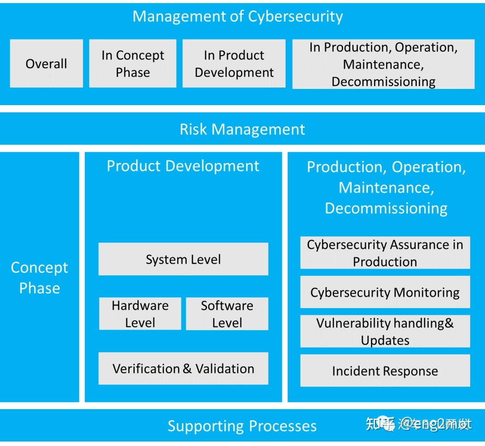

# ISO/SAE 21434

* `ISO/SAE 21434`=`ISO 21434`
  * 是什么：一个安全标准=安全规范
  * 领域：汽车行业
  * 一句话概述：`ISO/SAE 21434`是`SAE`和`ISO`共同制定的第一个汽车行业的网络安全标准
  * 背景
    * 当前OEM无法保证车辆在连接网络后不会带来不可预知的风险，因为没有安全性的衡量标准，在开发软件/固件的过程中也没有遵循任何标准，确保车辆的安全性
    * 汽车领域对网络安全的需求是定义可以在整个供应链中使用的通用语言或术语。为了应对汽车行业中的网络安全挑战，现已提出ISO / SAE 21434，以在汽车领域内建立共同点
    * `ISO/SAE 21434`是一个单一标准，适用于车辆中任何与外部网络相连的系统或者组件
  * 架构
    * 
  * 最新状态：ISO/SAE21434标准最终版已于2020年完成
  * 内容
    * 概述
      * 规定了道路车辆，其组件以及整个工程(如概念、设计和开发)、生产、运行、维护等过程中的网络安全风险管理要求
        * 像ISO26262管理功能安全要求一样
        * 目的：管理道路车辆电气和电子系统的网络安全威胁
      * 全面规定了道路车辆及其部件和接口的网络安全要求
        * 详细描述了如何根据网络安全问题实现网络安全管理目标
    * 图
      * 
    * 细节
      * 主要从15个方面对车辆的网络安全进行了阐述
        * 其中5-7章：从宏观上介绍车辆网络安全的总体要求
          * 整体网络安全管理
          * 基于项目的网络安全管理
          * 持续网络安全活动
        * 后续的7个章节：按照产品全生命周期的顺序，定义了从风险评估、概念开发、验证到生产、运维、退役等各阶段对于车辆网络安全的要求
        * 最后一章：“分布式网络安全活动”主要介绍当前车辆分布式合作开发的背景下，对于资产识别，要求报价，责任分布等方面的网络安全要求
      * 每个章节都是从“概要、目的、输入、要求和建议、工作产品”5个角度进行叙述
  * 评价
    * ISO/SAE 21434 被看作一项业界共识，是目前网络安全方面监管和认证机构的重要参考文件